# Git使用教程

## Git是什么

Git是目前世界上最先进的分布式版本控制系统

### Git的诞生

一些历史不在多说....

Git是用C语言开发的

### 集中式 Vs 分布式

**集中式**

集中式版本控制系统: 版本库是集中存放在中央服务器, 而干活的时候, 用的都是自己的电脑, 所以要先从中央服务器取得最新的版本, 然后开始干活, 干完活了, 在把自己的活推送给中央服务器, 重要服务器就好比一个图书馆, 你要改一本书, 必须先从图书馆借出来, 然后回到家自己改, 改完了, 在放回图书馆

集中式版本控制系统最大的毛病就是必须联网工作, 如果网速慢的话, 真的很麻烦

**分布式**

分布式版本控制系统: 没有中央服务器, 每个人的电脑上都是一个完整的版本库, 这样你在工作的时候就不需要联网了, 因为版本库就在你自己的电脑上, 既然每个人电脑上都有一个完整的版本库, 那么多人协作的时候, 只需要把各自的修改推送给对方, 就可以互相看到对方的修改了

和集中式版本控制相比, 分布式版本控制系统的安全性要高很多, 因为每个人电脑里都有完整的版本库, 某一个人的电脑坏掉不要紧, 随便从其他人哪里复制一个就可以, 而集中式版本系统的中央服务器要是出现问题, 所有人都没法干活了

而实际使用分布式版本控制系统的时候, 其实很少在两个人之间的电脑上推送版本库的修改, 因为可能你们俩不在一个局域网内, 两台电脑互相访问不了, 也可能今天你的同事病了, 它的电脑压根没有开机, 因此分布式版本控制系统也有一台充当中央服务器的电脑, 但这个服务器的作用仅仅是用来方便交换大家的修改, 没有它大家也一样干活, 只是交换修改不方便而已

当然Git的优势不单单是不必联网这一点, 后面我们还会看到Git极为强大的分支管理,

## 安装GIt

自己了解...

**windows安装Git配置**

```bash
$ git config --global user.name "Your Name"
$ git config --global user.email "email@example.com"
```

## 创建版本库

什么是版本库呢? 版本库又名仓库(Repository), 你可以简单理解成一个目录, 这个目录里面的所有文件都可以被Git管理, 每个文件的修改, 删除, Git都能之中追踪, 以便任何时刻都可以追踪历史, 或者在某个时刻可以还原

所以创建一个版本库非常简单, 首先选择一个合适的地方, 创建一个空目录:

```bash
$ mkdir learngit
$ cd learngit
$ pwd
/Users/michael/learngit
```

通过`git init`命令把这个目录变成Git可以管理的仓库

```bash
$ git init
Initialized empty Git repository in /Users/michael/learngit/.git/
```

当前目录下会多出一个`.git`的目录, 这个目录是Git来跟踪版本库的, 没事不要手动修改这个目录里面的文件, 很容把Git仓库破坏了

### 把文件添加到版本库中

所有的版本控制系统, 其实只能跟踪文本文件的改动

把一个文件放到Git仓库只需要两步

- 使用`git add`命令将文件添加到仓库

  ```bash
  $ git add readme.txt
  ```

- 使用`git commit`命令告诉Git, 把文件提交到仓库

  ```bash
  $ git commit -m "wrote a readme file"
  [master (root-commit) eaadf4e] wrote a readme file
   1 file changed, 2 insertions(+)
   create mode 100644 readme.txt
  ```

`git commit`命令, `-m`后面输入的是本次提交的说明, 可以输入任意的内容, 当然最好是有意义的, 这样你就能从历史记录中方便找到改动的内容

`git commit`命令执行更改后会告诉你, `1 file changed`: 一个文件被改动;`2 insertions`: 插入了两行内容

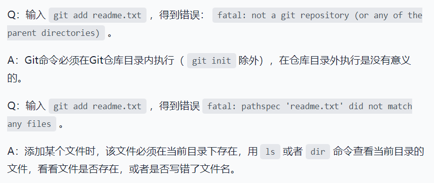

## 版本回溯

我们可以使用`git status`命令查看我们仓库中文件的状态:

```bash
$ git status
On branch master
Changes not staged for commit:
  (use "git add <file>..." to update what will be committed)
  (use "git checkout -- <file>..." to discard changes in working directory)

	modified:   readme.txt

no changes added to commit (use "git add" and/or "git commit -a")
```

`git status`命令可以让我们查看仓库当前的状态

我们可以使用`git diff`命令来查看某个文件被修改的内容

```bash
$ git diff readme.txt 
diff --git a/readme.txt b/readme.txt
index 46d49bf..9247db6 100644
--- a/readme.txt
+++ b/readme.txt
@@ -1,2 +1,2 @@
-Git is a version control system.
+Git is a distributed version control system.
 Git is free software.
```

`git diff`顾名思义就是查看difference

### 版本回退

每当你觉得文件修改到一定程度的时候, 就可以保存一个快照, 这个快照在Git中被称为`commit`, 一个你把这个文件该乱了, 或者误删除文件, 还可以从最近的一个`commit`中恢复, 然后继续工作

我们可以使用`git log`命令查看我们的提交历史记录::

```bash
$ git log
commit 1094adb7b9b3807259d8cb349e7df1d4d6477073 (HEAD -> master)
Author: Michael Liao <askxuefeng@gmail.com>
Date:   Fri May 18 21:06:15 2018 +0800

    append GPL

commit e475afc93c209a690c39c13a46716e8fa000c366
Author: Michael Liao <askxuefeng@gmail.com>
Date:   Fri May 18 21:03:36 2018 +0800

    add distributed

commit eaadf4e385e865d25c48e7ca9c8395c3f7dfaef0
Author: Michael Liao <askxuefeng@gmail.com>
Date:   Fri May 18 20:59:18 2018 +0800

    wrote a readme file
```

`git log`命令显示从最近到最远的提交日志, 我们可以看到3次提交

如果觉得输出的内容较多, 看的眼花缭乱, 可以试试加上`--pretty=oneline`参数

```bash
$ git log --pretty=oneline
1094adb7b9b3807259d8cb349e7df1d4d6477073 (HEAD -> master) append GPL
e475afc93c209a690c39c13a46716e8fa000c366 add distributed
eaadf4e385e865d25c48e7ca9c8395c3f7dfaef0 wrote a readme file
```

你看到的一大串内容是`commit id`(版本号), 这是一个SHA1计算出来的非常大的数字, 用十六进制表示, 为什么`commit id`需要用这么一大串数字表示呢? 因为Git是分布式版本控制系统, 后面我们还要研究在同一个版本库中工作, 如果大家都使用1,2,3这种作为版本号, 那肯定就冲突了

每提交一个新版本, 实际上Git就会把他们自动串成一条时间先, 如果使用可视化工具查看Git历史, 就可以更清楚的看到提交历史的时间线

如果我们向回退到上一个版本该怎么办?

首先Git必须知道当前版本是那个版本, 在Git中用`HEAD`表示当前版本, 也就是最新的提交, 上一个版本就是`HEAD^`, 上上个就是`HEAD^^`以此类推, 当然100版本写100个`^`也是不太容易的, 所以写成了`HEAD~100`

现在我们要回退上一个版本就可以使用`git reset`命令: 

```bash
$ git reset --hard HEAD^
HEAD is now at e475afc add distributed
```

`--head`参数有啥意义? `--head`会回退到上个版本的已提交状态, 而`--soft`会回退到上个版本的未提交状态, `--mixed`会回退到上个版本一添加但为提交的状态

我们可以在使用`git log`查看现在的版本库的状态:

```bash
$ git log
commit e475afc93c209a690c39c13a46716e8fa000c366 (HEAD -> master)
Author: Michael Liao <askxuefeng@gmail.com>
Date:   Fri May 18 21:03:36 2018 +0800

    add distributed

commit eaadf4e385e865d25c48e7ca9c8395c3f7dfaef0
Author: Michael Liao <askxuefeng@gmail.com>
Date:   Fri May 18 20:59:18 2018 +0800

    wrote a readme file
```

最新的版本已经看不到了, 想要回去该怎么办?

只要上面的命令行窗口还没有关闭, 你就可以顺着向上找, 找到最新版本的`commid id`, 于是就可以指定回到某个版本:

```bash
$ git reset --hard 1094a
HEAD is now at 83b0afe append GPL
```

`commit id`没有闭包写全, 前几位就可以, 但是你也不可以写的太少

Git的回退速度非常快, 因为GIt在内部有个指向当前版本的指针的`HEAD`指针, 当你回退版本的时候, Git仅仅是把HEAD从新指向原来的版本

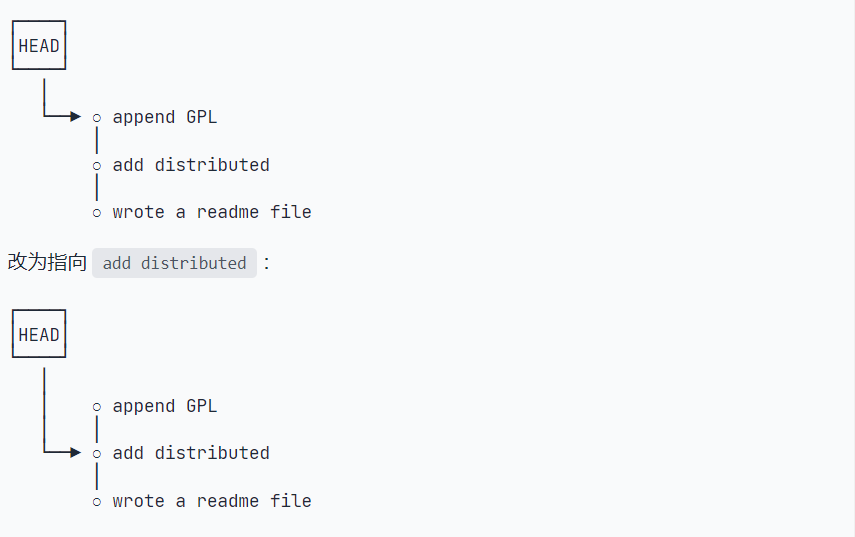

假如你把之前的命令行关闭了, 找不到最新的`commit id`该怎么办

你i使用`git reflog`命令用来记录你的每一次命令

```bash
$ git reflog
e475afc HEAD@{1}: reset: moving to HEAD^
1094adb (HEAD -> master) HEAD@{2}: commit: append GPL
e475afc HEAD@{3}: commit: add distributed
eaadf4e HEAD@{4}: commit (initial): wrote a readme file
```

### 工作区和暂存区

**工作区(Working Directory)**

就是你在电脑李能看到的目录

**版本库(Repository)**

工作区有一个隐藏目录`.git`, 这个不算工作区, 而是Git的版本库

Git的版本库中存了很多东西, 其中最重要的就是称为stage(或者叫index)的暂存区, 还有Git为我们自动创建的第一个分支`master`, 以及指向`master`的一个指针叫`HEAD`

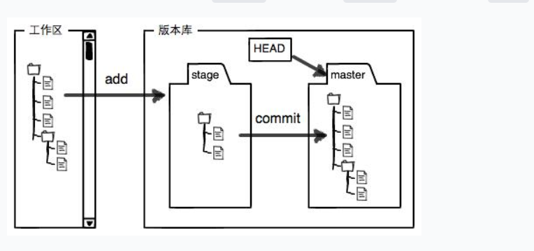

之前我们降到我们把问价往Git版本库里面添加的时候, 是分两步执行的:

第一步是用`git add`把文件添加进去, 实际上就是把文件修改添加到暂存区

第二步是用`git commit`提交更改, 实际上就是把暂存区的所有内容提交到当前分支

因为我们创建Git版本库的会后, Git自动为我们创建一个唯一一个`master`分支, 所以我们的`git commit`就是往`master`分支上提交修改

你可以简单理解为, 需要提交的文件修改统统放到暂存区, 然后一次性提交暂存区的所有修改

`git add`命令实际上即使要把提交的所有修改放到暂存区(Stage), 然后执行`git commit`就可以一次性把暂存区的所有修改提交到分支

```bash
$ git commit -m "understand how stage works"
[master e43a48b] understand how stage works
 2 files changed, 2 insertions(+)
 create mode 100644 LICENSE
```

一旦提交后, 如果你又没有对工作区做任何修改, 那么工作区就是干净的

```bash
$ git status
On branch master
nothing to commit, working tree clean
```

### 管理修改

为什么Git比其他版本控制系统设计的优秀, 因为Git跟踪管理的是修改, 而非文件

你会问, 什么是修改? 比如新增一行等一系列的操作, 就是一个修改

为什么说Git管理的是修改, 而不是文件呢? Git只会把暂存区的内容提交, 如果修改的内容没有放到暂存区, 则不会对其进行提交

### 撤销修改

在提交之前, 如果你发现暂存区中的内容不想就改了, 你可以使用`git checkout --file`命令丢弃工作区的修改

```bash
$ git checkout -- readme.txt
```

这个命令有两种情况:

一种是这个文件自修改后没有被放在暂存区, 则撤销会和版本库一模一样的状态

一种是已经添加到暂存区, 又做修改, 则撤销修改回到添加到暂存区后的状态

如果你在提交之前, 突然想把暂存区的内容撤销到工作区, 那我们可以使用`git reset HEAD <file>`命令, 把暂存区的修改撤销, 重新回到工作区

`git reset`命令不仅可以回退版本, 还可以把暂存区的内容回退到工作区

### 删除文件

如果你删除一个文件, Git会知道你删除了文件, 使用`git status`命令可以看到:

```bash
$ git status
On branch master
Changes not staged for commit:
  (use "git add/rm <file>..." to update what will be committed)
  (use "git checkout -- <file>..." to discard changes in working directory)

	deleted:    test.txt

no changes added to commit (use "git add" and/or "git commit -a")
```

现在你有两个选择, 确实要从版本库中删除该文件, 那就用命令`git rm`, 并且`git commit`

```rust
$ git rm test.txt
rm 'test.txt'

$ git commit -m "remove test.txt"
[master d46f35e] remove test.txt
 1 file changed, 1 deletion(-)
 delete mode 100644 test.txt
```

另一种情况时删除了, 因为版本库中还有, 你可以很轻松的将误删的文件恢复到最新版本

```bash
$ git checkout -- test.txt
```

## 远程仓库

### 添加远程仓库

**添加远程仓库**

```bash
$ git remote add origin git@github.com:michaelliao/learngit.git
```

**推送**

```bash
$ git push -u origin master
```

这个命令将你本地的master分支和远程的master分支关联起来

**删除远程仓库**

```bash
$ git remote -v // 查看所有远程库
```

```bash
$ git remote rm origin // 删除远程库
```

### 从远程仓库克隆

使用`git clone`克隆一个本地库

```bash
$ git clone git@github.com:michaelliao/gitskills.git
Cloning into 'gitskills'...
remote: Counting objects: 3, done.
remote: Total 3 (delta 0), reused 0 (delta 0), pack-reused 3
Receiving objects: 100% (3/3), done.
```

## 分支管理

### 创建与合并分支

在版本回退里, 每次提交, Git都会把它们串成一条时间线, 这条时间线就是一个分支, 截止到目前, 在Git里面, 这个分支叫主分支, 即`master`分支, `HEAD`严格来说不是指向提交, 而是指向`master`, `master`才是指向提交的, 所有`HEAD`指向的是就是当前分支

一开始的时候, `master`分支是一条线, Git用`master`指向最新的提交, 在用`HEAD`指向`master`, 就能确定当前分支, 以及当前分支的提交点

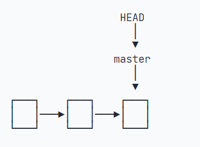

每次提交, `master`分支都会向前移动异步, 这样随着你不断提交, `master`分支的线也越来越长

当我们创建新的分支, 例如`dev`时, Git新建了一个指针叫`dev`, 指向`master`相同的提交, 在把`HEAD`指向`dev`, 就表示当前分支在`dev`上

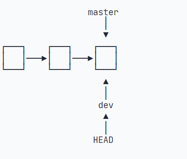

你看, Git创建一个分支很快, 因为除了增加一个`dev`指针, 改改`HEAD`的指向, 工作区的文件都没有任何变化

不过, 从现在开始, 对工作区的修改和提交就是针对`dev`分支了, 比如新提交一次后, `dev`指针往前移动一步, 而`master`指针不变

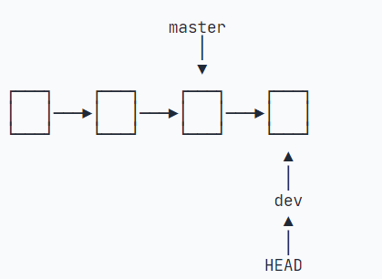

加入我们在`dev`上的工作完成了, 就可以把`dev`合并到`master`上, Git怎么合并呢? 最简单的方法, 就是直接把`master`指向`dev`的当前提交, 就完成了合并

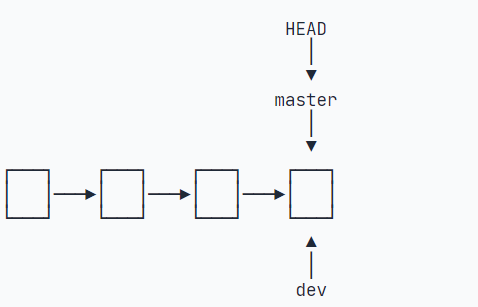

所以Git合并也很快, 就改改指针, 工作区内容也不变

合并完分支后, 甚至可以删除`dev`分支, 删除`dev`恩智就是把`dev`指针给删除掉, 删掉后, 我们就剩下了`master`分支

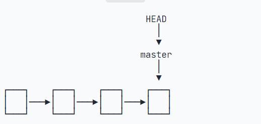


创建`dev`分支, 然后切换到`dev`分支上:

```bash
$ git checkout -b dev
```

`git branch -b`这个命令表示创建并切换, 相当于以下两条命令:

```bash
$ git branch dev
$ git checkout dev
Switched to branch 'dev'
```

然后, 用`git branch`命令查看当前分支:

```bash
$ git branch
* dev
  master
```

`git branch`命令会列出所有分支, 当前分支前面会标一个`*`号

然后哦我们就可以在`dev`分支上进行修改, 然后提交

`dev`分支工作完成, 切换回`master`分支:

```bash
$ git checkout master
```

切换回`master`分支后, 在查看修改的文件, 发现在`dev`分支后的内容不见了, 因为那个提交是在`dev`分支上, 而`master`分支提交点并没有变:

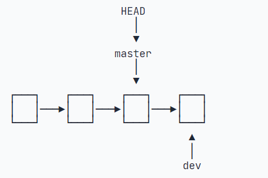

现在, 我们把`dev`分支的工作成功合并到`master`分支上:

```bash
$ git merge dev
Updating d46f35e..b17d20e
Fast-forward
 readme.txt | 1 +
 1 file changed, 1 insertion(+)
```

`git merge`命令用于合并指定分支到当前分支, 合并后, 在查看添加的内容, 就可以看到了, 和`dev`分支的最新提交是完全一样的

注意到上面的信息`Fast-forward`, Git告诉我们, 这次合并是`快进模式`, 也就是直接把`master`指向`dev`的当前提交, 所以合并速度非常快

当然, 也不是每次合并都能`Fast-forword`, 后面会讲其他方式的合并

合并完成后, 就可以删除`dev`分支了:

```bash
$ git branch -d dev
```

**switch**

我们切换分支使用`git checkout <branch>`和之前撤销修改的`git branch -- <file>`, 同一个命令, 可能会让人导致疑惑

我们可以使用`switch`

创建并切换到新的分支:

```bash
$ git switch -c dev
```

切换分支:

```bash
$ git switch master
```

### 解决冲突

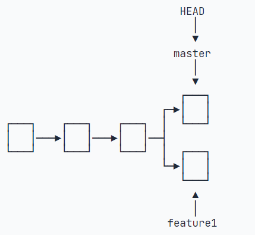

这种情况下, Git无法执行`快速合并`, 只能试图把各自的修改合并起来, 按这种合并就可能会有冲突

```bash
$ git merge feature1
Auto-merging readme.txt
CONFLICT (content): Merge conflict in readme.txt
Automatic merge failed; fix conflicts and then commit the result.
```

果然冲突了, Git告诉我们, 它们两个有冲突, 必须手动解决冲突后在提交, `git status`命令会告诉我们冲突的文件:

```bash
$ git status
On branch master
Your branch is ahead of 'origin/master' by 2 commits.
  (use "git push" to publish your local commits)

You have unmerged paths.
  (fix conflicts and run "git commit")
  (use "git merge --abort" to abort the merge)

Unmerged paths:
  (use "git add <file>..." to mark resolution)

	both modified:   readme.txt

no changes added to commit (use "git add" and/or "git commit -a")
```

我们可以直接查看文件中的内容

```bash
Git is a distributed version control system.
Git is free software distributed under the GPL.
Git has a mutable index called stage.
Git tracks changes of files.
<<<<<<< HEAD
Creating a new branch is quick & simple.
=======
Creating a new branch is quick AND simple.
>>>>>>> feature1
```

Git使用`<<<<<<<`，`=======`，`>>>>>>>`, 标记出不同分支的内容, 我们修改如下后保存, 在提交

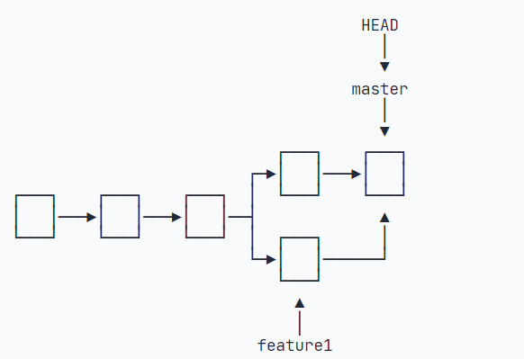

用待参数的log也可以看出分支合并的情况, `git log --graph --pretty=oneline --abbrev-commit`命令:

```bash
$ git log --graph --pretty=oneline --abbrev-commit
*   cf810e4 (HEAD -> master) conflict fixed
|\  
| * 14096d0 (feature1) AND simple
* | 5dc6824 & simple
|/  
* b17d20e branch test
* d46f35e (origin/master) remove test.txt
* b84166e add test.txt
* 519219b git tracks changes
* e43a48b understand how stage works
* 1094adb append GPL
* e475afc add distributed
* eaadf4e wrote a readme file
```

## 分支管理信息

通常在合并分支的时候, Git会使用`Fast forward`模式, 但在这种模式下, 删除分支后, 会丢掉分支信息, 如果要丢掉分支信息, 如果要强制禁用`Fast forward`模式, Git就会在merge时生成一个新的commit, 这样从分支历史上就可以看出分支信息

下面我们试一下`--no-ff`方式的`git merge`

```bash
$ git merge --no-ff -m "merge with no-ff" dev
Merge made by the 'recursive' strategy.
 readme.txt | 1 +
 1 file changed, 1 insertion(+)
```

```bash
$ git log --graph --pretty=oneline --abbrev-commit
*   e1e9c68 (HEAD -> master) merge with no-ff
|\  
| * f52c633 (dev) add merge
|/  
*   cf810e4 conflict fixed
...
```

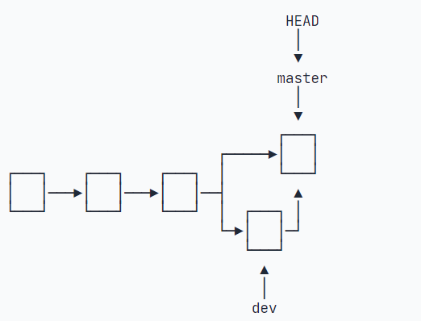

### Bug分支

在当你在开发的某一个分支的时候, 需要去主(或者其他)分支中区修改一个Bug, 但是你的工作还未提交, 那该怎么办?

此时你可以使用`git stash`功能, 尅把当前工作现场储藏起来, 当以后恢复现场后继续工作

```bash
$ git stash
Saved working directory and index state WIP on dev: f52c633 add merge
```

现在, 用`git status`查看工作区, 就是干净的, 因此可以放心的创建分支来修复Bug

修复完Bug后, 接着回到`dev`分支, 我们可以使用`git stash list`查看我们储藏起来的工作线程

有两个办法可以恢复:

一是用`git stash apply`恢复, 但是恢复后, `stash`内容并不删除, 你需要用`git stash drop`来删除

另一种是用`git stash pop`, 恢复的同时把`stash`内容也删了

```bash
$ git stash pop
On branch dev
Changes to be committed:
  (use "git reset HEAD <file>..." to unstage)

	new file:   hello.py

Changes not staged for commit:
  (use "git add <file>..." to update what will be committed)
  (use "git checkout -- <file>..." to discard changes in working directory)

	modified:   readme.txt

Dropped refs/stash@{0} (5d677e2ee266f39ea296182fb2354265b91b3b2a)
```

你可以多次`stash`, 恢复的时候, 先用`git stash list`查看, 然后恢复指定的`stash`:

```bash
$ git stash apply stash@{0}
```

如果我们想在当前分支上修改之前的Bug, 我们只需要将提交的`commit id`复制到`dev`分支上, 我们是用`cherry pick`命令, 让我们能复制一个特定的提交到当前分支:

```bash
$ git branch
* dev
  master
$ git cherry-pick 4c805e2
[master 1d4b803] fix bug 101
 1 file changed, 1 insertion(+), 1 deletion(-)
```

### Feature分支

如果要丢弃一个没有被合并过的分支使用`git branch -D <name>`强行删除

### 多人协作

**关联本地分支和远程分支**

使用命令`git branch --set-upstream-to <branch-name> origin/<branch-name>`

### Rebase

Git有一种称为`rebase`的操作, 有人把它翻译成变基, 使用`git rebase`命令

rebase操作可以把本地未push的分叉提交历史整理成直线

rebase的目的是使得我们在查看历史提交的变化时更容易, 因为分叉的提交需要三方对比

## 标签管理

使用`git` tag <name>`命令打一个标签:

```bash
$ git tag v1.0
```

使用`git tag`命令查看所有标签:

```bash
$ git tag
v1.0
```

使用`commit id`打之前提交的标签:

```bash
$ git tag v0.9 f52c633
```

使用`git show <tagname>`查看标签信息:

```bash
$ git show v0.9
commit f52c63349bc3c1593499807e5c8e972b82c8f286 (tag: v0.9)
Author: Michael Liao <askxuefeng@gmail.com>
Date:   Fri May 18 21:56:54 2018 +0800

    add merge

diff --git a/readme.txt b/readme.txt
...
```

创建带有说明的标签, `-a`指定标签名, `-m`指定说明文字

```bash
$ git tag -a v0.1 -m "version 0.1 released" 1094adb
```

删除标签使用`git tag -d <tagname>`

```bash
$ git tag -d v0.1
Deleted tag 'v0.1' (was f15b0dd)
```

推动标签到远程, 使用`git push origin <tagname>`命令

```bash
$ git push origin v1.0
Total 0 (delta 0), reused 0 (delta 0)
To github.com:michaelliao/learngit.git
 * [new tag]         v1.0 -> v1.0
```

一次性推送全部尚未推送到远程的本地标签:

```bash
$ git push origin --tags
Total 0 (delta 0), reused 0 (delta 0)
To github.com:michaelliao/learngit.git
 * [new tag]         v0.9 -> v0.9
```

如果标签已经推送到远程, 要删除远程标签就麻烦一点, 先从本地删除:

```bash
$ git tag -d v0.9
Deleted tag 'v0.9' (was f52c633)
```

然后, 从远程删除, 删除命令也是`push`, 但是格式如下

```bash
$ git push origin :refs/tags/v0.9
```

## 自定义Git

### 忽略特殊文件

使用`.gitignore`文件

### 配置别名

使用`git config --global alias.XX MM`, 使用`XX`代替`MM`

```bash
$ git config --global alias.st status
```

```bash
git config --global alias.lg "log --color --graph --pretty=format:'%Cred%h%Creset -%C(yellow)%d%Creset %s %Cgreen(%cr) %C(bold blue)<%an>%Creset' --abbrev-commit"
```

**配置文件**

配置Git的时候, 加上`--global`是针对当前用户其作用的, 如果不加, 那只针对当前仓库其作用, 配置文件在`.git/config`文件中

当前用户的配置文件在, 在用户主目录下的一个隐藏文件`.gitconfig`

## Git命令

```git
git init                                                  # 初始化本地git仓库（创建新仓库）
git config --global user.name "xxx"                       # 配置用户名
git config --global user.email "xxx@xxx.com"              # 配置邮件
git config --global color.ui true                         # git status等命令自动着色
git config --global color.status auto
git config --global color.diff auto
git config --global color.branch auto
git config --global color.interactive auto
git config --global --unset http.proxy                    # remove  proxy configuration on git
git clone git+ssh://git@192.168.53.168/VT.git             # clone远程仓库
git status                                                # 查看当前版本状态（是否修改）
git add xyz                                               # 添加xyz文件至index
git add .                                                 # 增加当前子目录下所有更改过的文件至index
git commit -m 'xxx'                                       # 提交
git commit --amend -m 'xxx'                               # 合并上一次提交（用于反复修改）
git commit -am 'xxx'                                      # 将add和commit合为一步
git rm xxx                                                # 删除index中的文件
git rm -r *                                               # 递归删除
git log                                                   # 显示提交日志
git log -1                                                # 显示1行日志 -n为n行
git log -5
git log --stat                                            # 显示提交日志及相关变动文件
git log -p -m
git show dfb02e6e4f2f7b573337763e5c0013802e392818         # 显示某个提交的详细内容
git show dfb02                                            # 可只用commitid的前几位
git show HEAD                                             # 显示HEAD提交日志
git show HEAD^                                            # 显示HEAD的父（上一个版本）的提交日志 ^^为上两个版本 ^5为上5个版本
git tag                                                   # 显示已存在的tag
git tag -a v2.0 -m 'xxx'                                  # 增加v2.0的tag
git show v2.0                                             # 显示v2.0的日志及详细内容
git log v2.0                                              # 显示v2.0的日志
git diff                                                  # 显示所有未添加至index的变更
git diff --cached                                         # 显示所有已添加index但还未commit的变更
git diff HEAD^                                            # 比较与上一个版本的差异
git diff HEAD -- ./lib                                    # 比较与HEAD版本lib目录的差异
git diff origin/master..master                            # 比较远程分支master上有本地分支master上没有的
git diff origin/master..master --stat                     # 只显示差异的文件，不显示具体内容
git remote add origin git+ssh://git@192.168.53.168/VT.git # 增加远程定义（用于push/pull/fetch）
git branch                                                # 显示本地分支
git branch --contains 50089                               # 显示包含提交50089的分支
git branch -a                                             # 显示所有分支
git branch -r                                             # 显示所有原创分支
git branch --merged                                       # 显示所有已合并到当前分支的分支
git branch --no-merged                                    # 显示所有未合并到当前分支的分支
git branch -m master master_copy                          # 本地分支改名
git checkout -b master_copy                               # 从当前分支创建新分支master_copy并检出
git checkout -b master master_copy                        # 上面的完整版
git checkout features/performance                         # 检出已存在的features/performance分支
git checkout --track hotfixes/BJVEP933                    # 检出远程分支hotfixes/BJVEP933并创建本地跟踪分支
git checkout v2.0                                         # 检出版本v2.0
git checkout -b devel origin/develop                      # 从远程分支develop创建新本地分支devel并检出
git checkout -- README                                    # 检出head版本的README文件（可用于修改错误回退）
git merge origin/master                                   # 合并远程master分支至当前分支
git cherry-pick ff44785404a8e                             # 合并提交ff44785404a8e的修改
git push origin master                                    # 将当前分支push到远程master分支
git push origin :hotfixes/BJVEP933                        # 删除远程仓库的hotfixes/BJVEP933分支
git push --tags                                           # 把所有tag推送到远程仓库
git fetch                                                 # 获取所有远程分支（不更新本地分支，另需merge）
git fetch --prune                                         # 获取所有原创分支并清除服务器上已删掉的分支
git pull origin master                                    # 获取远程分支master并merge到当前分支
git mv README README2                                     # 重命名文件README为README2
git reset --hard HEAD                                     # 将当前版本重置为HEAD（通常用于merge失败回退）
git rebase
git branch -d hotfixes/BJVEP933                           # 删除分支hotfixes/BJVEP933（本分支修改已合并到其他分支）
git branch -D hotfixes/BJVEP933                           # 强制删除分支hotfixes/BJVEP933
git ls-files                                              # 列出git index包含的文件
git show-branch                                           # 图示当前分支历史
git show-branch --all                                     # 图示所有分支历史
git whatchanged                                           # 显示提交历史对应的文件修改
git revert dfb02e6e4f2f7b573337763e5c0013802e392818       # 撤销提交dfb02e6e4f2f7b573337763e5c0013802e392818
git ls-tree HEAD                                          # 内部命令：显示某个git对象
git rev-parse v2.0                                        # 内部命令：显示某个ref对于的SHA1 HASH
git reflog                                                # 显示所有提交，包括孤立节点
git show HEAD@{5}
git show master@{yesterday}                               # 显示master分支昨天的状态
git log --pretty=format:'%h %s' --graph                   # 图示提交日志
git show HEAD~3
git show -s --pretty=raw 2be7fcb476
git stash                                                 # 暂存当前修改，将所有至为HEAD状态
git stash list                                            # 查看所有暂存
git stash show -p stash@{0}                               # 参考第一次暂存
git stash apply stash@{0}                                 # 应用第一次暂存
git grep "delete from"                                    # 文件中搜索文本“delete from”
git grep -e '#define' --and -e SORT_DIRENT
git gc
git fsck
```

