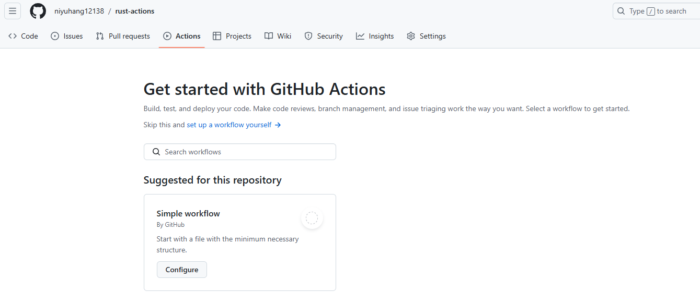
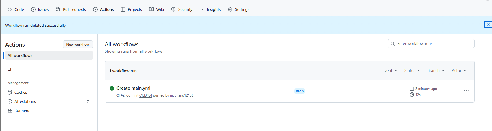
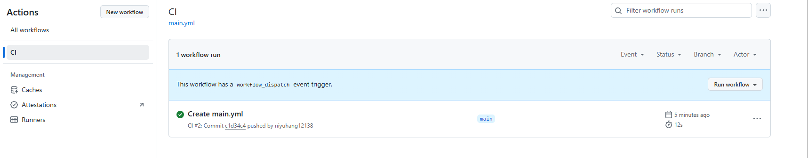
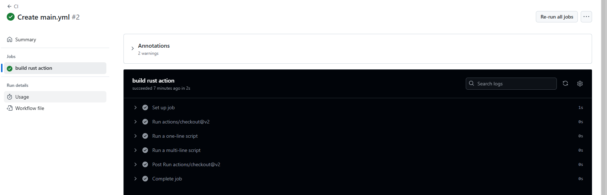
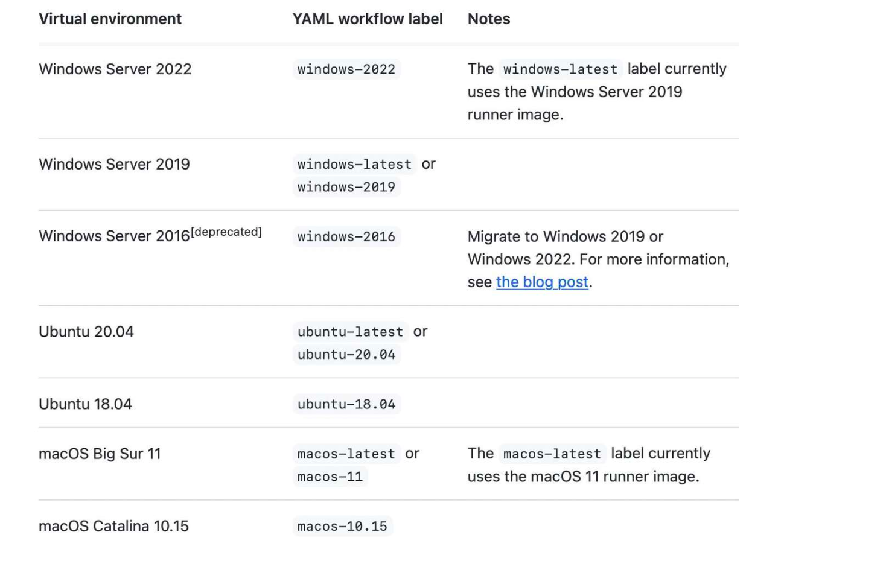

# GitHub Actions

GitHub Actions是官方于2018年推出的持续集成服务, 它非常强大, 本文将手把手带领大家学习如何使用`GitHub Actions`对Rust项目进行持续集成

持续集成是软件开发中异常重要的一环, 大家都应该听说过`Jenkins`, 它就是一个拥有悠久历史的持续集成工具, 简单来说, 持续集成会定期拉去同一个项目中所有成员的相关代码, 对其进行自动化构建

在没有持续集成前, 首先开发者需要手动编译代码并运行单元测试, 集成测试等基础测试, 然后启动项目相关的所有服务, 接着测试人员开始介入对整个项目进行回归测试, 黑盒测试等系统化的测试, 当测试通过后, 最后在手动发布到指定的环境中运行, 这个过程是非常冗长, 且所有成员都需要同时参与的

在有了持续集成后, 只要编写好相应的编译, 测试, 发布配置文件, 那持续集成平台会帮助我们完成整个相关的流程, 期间无需任何人介入, 高效且可靠

## GitHub Actions

而本文的主角正式这样的持续集成平台, 它由GitHub官方提供, 并且跟GitHub进行了深度的整合, 其中`actions`代表了代码拉取, 测试运行, 登录远程服务器, 发布到第三方服务等操作行为

最妙的是GitHub发现这些`actions`其实在很多项目中都是类似的, 意味着`actions`完全可以被多个项目共享使用, 而不是每个项目都从零开始开发自己的`actions`

如你需要某个`action`, 不必自己写复杂的脚本, 直接引用他人写好的`action`即可, 整个持续集成过程, 就变成了多个`action`的组合, 这就是`GitHub Actions`最厉害的地方

### action的分享与引用

既然`action`这么强大, 我们就可以将自己的`action`分享给他人, 特可以引用他人分享的`action`, 有以下的几种方式:

1. 将你的`action`放在GitHub上的公共仓库, 这样其他开发者就可以引用, [github-profile-summary-cards](https://github.com/vn7n24fzkq/github-profile-summary-cards)就提供了对应的`action`, 可以生成GitHub用户统计信息, 然后嵌入到你的个人主页中
2. GitHub提供了同一个官方市场, 里面收集了许多质量不错的`actions`, 并支持在线搜索: https://github.com/marketplace?type=actions
3. 第三方开发者收集并整理的actions: https://github.com/sdras/awesome-actions
4. 官方提供的工作流(workflow)模版: https://github.com/actions/starter-workflows

对于第一点这里在补充下, 如果你想要引用某个代码仓库中的`action`, 可以通过`username/repoName`方式来引用

由于`action`是代码仓库, 因此就有了版本的概念, 你可以使用`@`符号来引入同一个仓库中不同版本的`action`, 例如:

```
actions/setup-node@master  # 指向一个分支
actions/setup-node@v2.5.1    # 指向一个 release
actions/setup-node@f099707 # 指向一个 commit
```

如果希望深入了解, 可以进一步查看官方的文档: https://docs.github.com/zh/actions/sharing-automations/creating-actions/about-custom-actions#using-release-management-for-actions

## Actions基础

在了解何为GitHub Actions后, 在来通过一个基本的例子来学习一下它的基本概念, 完整内容请参考: https://docs.github.com/zh/actions

### 创建action demo

首先, 为了演示, 我们需要创建一个公开的GitHub仓库, `rust-action`, 然后子啊仓库主页的导航栏中点击`Actions`, 你会看到如下页面: 



接着点击`set up a workflow yourself ->`, 你将看到系统为你自动创建的一个工作流workflow吗子啊`rust-action/.github/workflows/main.yml`文件中包含以下内容:

```yml
# 下面是一个基础的工作流，你可以基于它来编写自己的 GitHub Actions
name: CI

# 控制工作流何时运行
on:
  # 当 `push` 或 `pull request` 事件发生时就触发工作流的执行，这里仅仅针对 `main` 分支
  push:
    branches: [main]
  pull_request:
    branches: [main]

  # 允许用于在 `Actions` 标签页中手动运行工作流
  workflow_dispatch:

# 工作流由一个或多个作业( job )组成，这些作业可以顺序运行也可以并行运行
jobs:
  # 当前的工作流仅包含一个作业，作业 id 是 "build"
  build:
    # 作业名称
    name: build rust action
    # 执行作业所需的运行器 runner
    runs-on: ubuntu-latest

    # steps 代表了作业中包含的一系列可被执行的任务
    steps:
      # 在 $GITHUB_WORKSPACE 下 checks-out 当前仓库，这样当前作业就可以访问该仓库
      - uses: actions/checkout@v2

      # 使用运行器的终端来运行一个命令
      - name: Run a one-line script
        run: echo Hello, world!

      # 使用运行器的终端运行一组命令
      - name: Run a multi-line script
        run: |
          echo Add other actions to build,
          echo test, and deploy your project.
```

### 查看工作流信息

通过内容的注释, 大家应该大概理解这个工作流式怎么回事了, 在具体讲解之前, 我们先完成`Actions`的创建, 点击右上角的`Start Commit`绿色按钮提交, 然后再回到`Actions`标签页, 你可以看到如下界面:



这里包含了我们刚创建的工作流及当前状态, 成功运行

还记得之前配置中的`workflow_dispatch`吗? 它允许工作流被手动执行: 点击左边的`All workflows -> CI`, 可以看到如下页面: 



页面中通过蓝色的醒目高亮提示我们`this workflow has a workflow_dispatch event trigger`, 因此, 可以点击右边的`Run workflow`手动再次执行该工作流, 刷新一下, 可以看到结果

点击`Create main.yml`可以查看该工作流的详细信息:



至此, 我们已经初步掌握了`GitHub Actions`的用法, 现在我们来看看一些基本的概念

### 基本概念

- GitHub Actions, 每个项目都拥有一个`Actions`, 可以包含多个工作流
- workflow工作流, 描述了一次持续集成的过程
- job作业, 一个工作流可以包含多个作业, 因此一次持续集成本身就由多个不同的部分组成
- step步骤, 每个作业由多个步骤组成, 按照顺序一步步完成
- action动作, 每个步骤可以包含多个动作, 例如上例中的`Run a multi-line script`步骤就包含了两个动作

可以看出, 每一个概念都是相互包含的关系, 前者包含了后者, 层层相扣, 正因为这些精心设计的对象才有了强大的`GitHub Actions`

### on

`on`可以设定事件用于触发工作流的运行:

1. 一个或者多个GitHub事件, 例如`push`一个`commit`, 创建一个`issue`, 提交一次`pr`, 详细的事件列表参见: https://docs.github.com/zh/actions/writing-workflows/choosing-when-your-workflow-runs/events-that-trigger-workflows

2. 预定时间, 例如每天零点零分触发, 详情参见: https://docs.github.com/zh/actions/writing-workflows/choosing-when-your-workflow-runs/events-that-trigger-workflows#schedule

   ```yaml
   on:
     schedule: -cron:'0 0 * * *'
   ```

3. 外部事件触发, 例如你可以通过`REST API`向GitHub发送请求去触发: https://docs.github.com/zh/actions/writing-workflows/choosing-when-your-workflow-runs/events-that-trigger-workflows#repository_dispatch

### jobs

工作流由一个或者多个作业的`job`组成, 这些作业可以顺序运行也可以并行运行, 同时我们还能使用`needs`来指定作业之间的依赖关系:

```yaml
jobs:
  job1:

  job2:
    needs: job1

  job3:
    needs: [job1, job2]
```

这里的`job2`必须等待`job1`成功后才能运行, 而`job3`则需要等待`job1`和`job2`

### runs-on

指定作业的运行环境, 运行期分为两种: `GitHub-hosted runner`和`self-hosted runner`, 后者是使用自己的机器来运行作业, 但是需要GitHub能进行访问并给予相应的机器权限, 感兴趣的参见: https://docs.github.com/zh/actions/writing-workflows/choosing-where-your-workflow-runs/choosing-the-runner-for-a-job#choosing-self-hosted-runners

而对于前者, GitHub提供一下的运行环境:



其中比较常用的就是`runson:ubuntu-latest`

### strategy.matrix

有时候我们常常需要对多个操作系统, 多个平台, 多个编程语言版本进行测试, 为此我们可以配置一个`matrix`矩阵: 

```yaml
runs-on: ${{ matrix.os }}
strategy:
  matrix:
    os: [ubuntu-18.04, ubuntu-20.04]
    node: [10, 12, 14]
steps:
  - uses: actions/setup-node@v2
    with:
      node-version: ${{ matrix.node }}
```

这段代码会最终构建6个作业, 通过`os`和`node`进行组合, 就可以得出结论, 这也是`matrix`矩阵名称的来源, 详情参见: https://docs.github.com/zh/actions/writing-workflows/choosing-what-your-workflow-does/running-variations-of-jobs-in-a-workflow

### strategy

除了`matrix`, `strategy`还能设定一下内容:

- `fail-fast`: 默认为true, 即一旦某个矩阵任务失败则立即取消所有还在进行中的任务
- `max-paraller`: 可同时执行的最大并发数, 默认情况下GitHub会动态调整

### env

用于设定环境变量, 可以用于以下地方:

- env
- jobs.<job_id>.env
- jobs.<job_id>.env

如果有多个`env`存在, 就会使用就近的那个

至此, `GitHub Actions`的常用内大家已经基本了解, 下面来看一个使用的示例:

## 案例: 生成GitHUb统计卡片

相信大家看过不少用户都定制了自己的个性化GitHub首页, 这个是通过在个人名下创建一个同名的仓库来实现的, 该仓库中的`Readme.md`的内容会自动展示在你的个人首页中

大家可能会好奇这种GitHub统计卡片如何生成, 其实有两种办法: 

- 使用https://github.com/anuraghazra/github-readme-stats
- 使用`GitHub Actions`来引用其他人提供的`action`生成对应的卡片, 在嵌入进来

第一种优点就是非常简单, 缺点是样式不太容易统一, 不能对齐对于强迫症来说实在是难以接受, 我们使用后者

在你的同名项目目录下创建`.github/workflows/profile-summary-cards.yml`文件, 然后填入以下内容:

```yaml
# 工作流名称
name: GitHub-Profile-Summary-Cards

on:
  schedule:
    # 每24小时触发一次
    - cron: "0 * * * *"
  # 开启手动触发
  workflow_dispatch:

jobs:
  # job id
  build:
    runs-on: ubuntu-latest
    name: generate

    steps:
      # 第一步，checkout 当前项目
      - uses: actions/checkout@v2
      # 第二步，引入目标 action: vn7n24fzkq/github-profile-summary-cards仓库中的 `release` 分支
      - uses: vn7n24fzkq/github-profile-summary-cards@release
        env:
          GITHUB_TOKEN: ${{ secrets.GITHUB_TOKEN }}
        with:
          USERNAME: ${{ github.repository_owner }}
```

## 使用Actions来构建Rust项目

其实Rust项目也没有特别之处, 我们只需要再`steps`逐步构建即可, 下面给出该如何测试和构建示例:

### 测试

```yaml
on: [push, pull_request]

name: Continuous integration

jobs:
  check:
    name: Check
    runs-on: ubuntu-latest
    steps:
      - uses: actions/checkout@v2
      - uses: actions-rs/toolchain@v1
        with:
          profile: minimal
          toolchain: stable
          override: true
      - run: cargo check

  test:
    name: Test Suite
    runs-on: ubuntu-latest
    steps:
      - uses: actions/checkout@v2
      - uses: actions-rs/toolchain@v1
        with:
          profile: minimal
          toolchain: stable
          override: true
      - run: cargo test

  fmt:
    name: Rustfmt
    runs-on: ubuntu-latest
    steps:
      - uses: actions/checkout@v2
      - uses: actions-rs/toolchain@v1
        with:
          profile: minimal
          toolchain: stable
          override: true
      - run: rustup component add rustfmt
      - run: cargo fmt --all -- --check

  clippy:
    name: Clippy
    runs-on: ubuntu-latest
    steps:
      - uses: actions/checkout@v2
      - uses: actions-rs/toolchain@v1
        with:
          profile: minimal
          toolchain: stable
          override: true
      - run: rustup component add clippy
      - run: cargo clippy -- -D warnings
```

### 构建

```yaml
name: build
on:
  workflow_dispatch: {}
jobs:
  build:
    name: build
    runs-on: ${{ matrix.os }}
    strategy:
      matrix:
        build: [linux, macos, windows]
        include:
          - build: linux
            os: ubuntu-18.04
            rust: nightly
            target: x86_64-unknown-linux-musl
            archive-name: sgf-render-linux.tar.gz
          - build: macos
            os: macos-latest
            rust: nightly
            target: x86_64-apple-darwin
            archive-name: sgf-render-macos.tar.gz
          - build: windows
            os: windows-2019
            rust: nightly-x86_64-msvc
            target: x86_64-pc-windows-msvc
            archive-name: sgf-render-windows.7z
      fail-fast: false

    steps:
      - name: Checkout repository
        uses: actions/checkout@v2

      - name: Install Rust
        uses: actions-rs/toolchain@v1
        with:
          toolchain: ${{ matrix.rust }}
          profile: minimal
          override: true
          target: ${{ matrix.target }}

      - name: Build binary
        run: cargo build --verbose --release --target ${{ matrix.target }}
        env:
          RUST_BACKTRACE: 1

      - name: Strip binary (linux and macos)
        if: matrix.build == 'linux' || matrix.build == 'macos'
        run: strip "target/${{ matrix.target }}/release/sgf-render"

      - name: Build archive
        shell: bash
        run: |
          mkdir archive
          cp LICENSE README.md archive/
          cd archive
          if [ "${{ matrix.build }}" = "windows" ]; then
            cp "../target/${{ matrix.target }}/release/sgf-render.exe" ./
            7z a "${{ matrix.archive-name }}" LICENSE README.md sgf-render.exe
          else
            cp "../target/${{ matrix.target }}/release/sgf-render" ./
            tar -czf "${{ matrix.archive-name }}" LICENSE README.md sgf-render
          fi
      - name: Upload archive
        uses: actions/upload-artifact@v1
        with:
          name: ${{ matrix.archive-name }}
          path: archive/${{ matrix.archive-name }}
```

